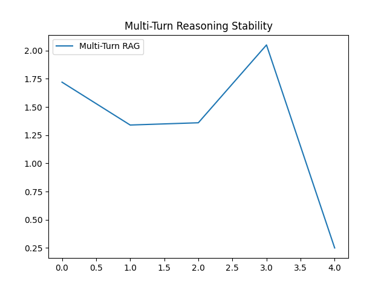
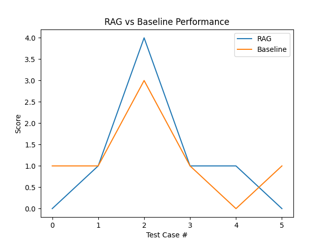

# Enhancing Small Language Models for Co-Creative Mathematical Storytelling using RAG

## Project Overview

The system combines **Retrieval-Augmented Generation (RAG)** with **conversation memory**, enabling a lightweight model (Gemma-2B) to:

* Maintain context across multiple turns 
* Perform accurate mathematical reasoning
* Generate simple, story-based explanations for children (Grades 1–6)

The entire pipeline is optimized for **CPU-only execution**, making it suitable for deployment in constrained educational environments.

---

## Key Features

### Multi-Turn Conversational Memory

* Full conversation history is passed to the LLM
* Enables continuity across multiple user queries
* Supports step-by-step reasoning across turns

### CPU-Optimized Inference

* Powered by **Ollama + Gemma-2B (quantized)**
* Runs efficiently on standard hardware (no GPU required)

### Retrieval-Augmented Generation (RAG)

* Uses a curated **Grades 1–6 mathematics knowledge base**
* FAISS provides fast semantic search
* Improves correctness and grounding of responses

### Controlled Prompting

* Prevents hallucinations and incorrect assumptions
* Ensures:

  * No repetition of user queries
  * No invented numbers
  * Focus on the actual question
  * Clear, concise responses

### Story-Based Learning

* Answers are explained using short, intuitive stories
* Designed for young learners to understand concepts easily

### Evaluation Framework

* Embedding quality testing
* Retrieval accuracy checks
* Multi-turn reasoning evaluation (10–20 turns)

---

## System Architecture

User Query
↓
Conversation Memory (Full History)
↓
FAISS Retrieval (Relevant Knowledge)
↓
Prompt Engine (Rules + Context)
↓
Gemma-2B via Ollama
↓
Final Response (Answer + Story)

---

## Technical Stack

* **LLM:** Gemma-2B (Quantized via Ollama)
* **Vector Database:** FAISS (Facebook AI Similarity Search)
* **Embeddings:** BAAI/bge-small-en-v1.5
* **Frameworks:** LangChain
* **Language:** Python 3.10+

---

## Project Structure

RAG Proj/
├── rag_env/                  # Virtual environment
├── data/
│   └── math_content.jsonl      # Structured math knowledge base
├── vector_db/
│   └── math_index/           # FAISS index files
├── scripts/
│   ├── ingest.py             # Builds vector database
│   ├── rag_engine.py         # Core RAG + memory engine
│   ├── test_embeddings.py    # Embedding evaluation
│   └── evaluator.py          # Multi-turn evaluation & scoring
└── README.md

---

## Setup & Installation

### 1. Prerequisites

Install Ollama from:
https://ollama.com

Pull the required model:

```
ollama pull gemma:2b 
```

---

### 2. Environment Setup

Create virtual environment:

```
python -m venv rag_env
```

Activate environment:

Linux / Mac:

```
source rag_env/bin/activate
```

Windows:

```
rag_env\Scripts\activate
```

Install dependencies:

```
pip install langchain langchain-community langchain-huggingface faiss-cpu sentence-transformers ollama langchain-ollama
```

---

### 3. Data Ingestion

Populate your knowledge base file:

```
data/math_content.jsonl
```

Then run:

```
python scripts/ingest.py
```

This will:

* Parse structured math content
* Generate embeddings
* Create FAISS index

---

### 4. Run the Application

```
python scripts/rag_engine.py
```

---

### 4. Run the Baseline Gemma Model

```
ollama run gemma:2b
```

---

## 🧪 Evaluation

### 🔍 Embedding Quality Test

```
python scripts/test_embeddings.py
```

Evaluates:

* Retrieval accuracy
* Concept similarity
* Noise robustness

---

### Multi-Turn Evaluation

```
python scripts/evaluator.py
```

Measures:

* Context retention
* Mathematical correctness
* Response consistency across multiple turns

---

## Design Goals

* Enable accurate math reasoning using small models
* Maintain conversation continuity across multiple turns
* Provide child-friendly explanations through storytelling
* Ensure low computational requirements (CPU-only)

---

## Limitations

* Gemma-2B may struggle with complex multi-step reasoning
* Performance depends on prompt quality and knowledge base coverage
* No symbolic math engine (pure LLM reasoning)

## Results
### Multi Turn Performance


### Rag vs Baseline Results
